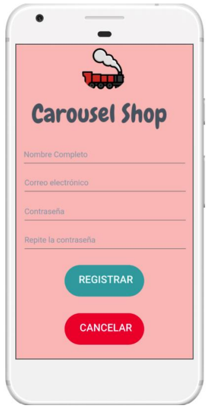
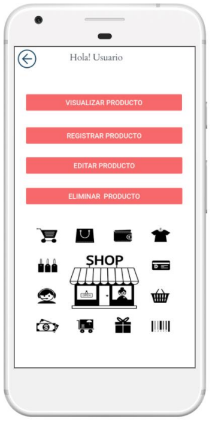
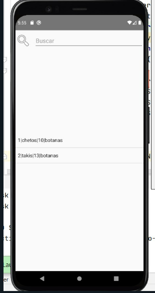
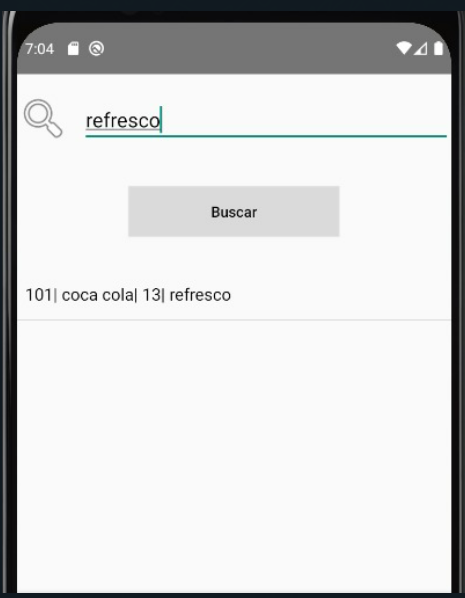

<h1 align="center"> Carousel Shop 🚂 </h1>
<h4 align="center">
:construction: Proyecto en construcción :construction:
</h4>

## Descripción del proyecto 📝 
Aplicación movil que simula una tienda de abarrotes y la gestión de sus productos 
que se almacenan en una Base de Datos de manera local(SQLite).

## Tecnologías empleadas
* Android Studio 4.1.2
* Java 11
* SQLite

### ***Capturas del proyecto***
###### Login

###### Registro de usuario nuevo

###### Inicio

###### Registrar producto

###### Visualizar productos

###### Buscar un producto por categoria

